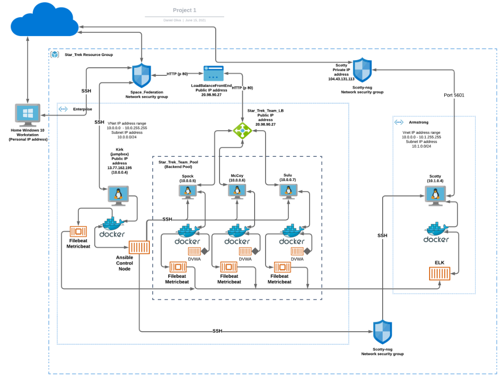

## Automated ELK Stack Deployment

The files in this repository were used to configure the network depicted below.

 

These files have been tested and used to generate a live ELK deployment on Azure. They can be used to either recreate the entire deployment pictured above. Alternatively, select portions of the **yaml** file may be used to install only certain pieces of it, such as Filebeat or Metricbeat.

  [install-elk.yml](Ansible/install-elk.yml)

This document contains the following details:
- Description of the Topology
- Access Policies
- ELK Configuration
  - Beats in Use
  - Machines Being Monitored
- How to Use the Ansible Build

### Description of the Topology

The main purpose of this network is to expose a load-balanced and monitored instance of DVWA, the D*mn Vulnerable Web Application.

**Load balancing ensures that the application will be highly redundant and available, in addition to restricting access to the network.**

**Load balancers protect the availability of the server. It reduce the attack vector on the back-end of the network.**

**Integrating an ELK server allows users to easily monitor the vulnerable VM's for changes to the configuration files and system logs.**

**Filebeat watches for Syslog, Sudo commands, SSH logins, and New users and groups.**
**Metricbeat records CPU and RAM usage, and Network Traffic.**

The configuration details of each machine may be found below.
| Name   | Function   | IP Address | Operating System |
|--------|------------|------------|------------------|
| Kirk   | Jump-box   | 10.0.0.4   | Linux            |
| Spock  | Web Server | 10.0.0.5   | Linux            |
| McCoy  | Web Server | 10.0.0.6   | Linux            |
| Sulu   | Web Server | 10.0.0.7   | Linux            |
| Scotty | ELK Server | 10.1.0.4   | Linux            |

### Access Policies

The machines on the internal network are not exposed to the public Internet. 

Only the Jump-box machine can accept connections from the Internet. Access to this machine is only allowed from the following IP address: My personal IP address
-  whitelisted (Personal IP address)

Machines within the network can only be accessed by the Jump-box.

- I have allowed Kirk  (Jump-box) access to the ELK Server and it's IP address is (10.0.0.4).

A summary of the access policies in place can be found in the table below.

| Name   | Publicly Accessible | Allowed IP Addresses |
|--------|---------------------|----------------------|
| Kirk   | yes                 | Personal IP          |
| Spock  | No                  | 10.0.0.0-254         |
| McCoy  | No                  | 10.0.0.0-254         |
| Sulu   | No                  | 10.0.0.0-254         |
| Scotty | No                  | 10.1.0.0-254         |

### Elk Configuration

Ansible is used to automate configuration of the ELK machine. No configuration was performed manually, which is advantageous because it lessens chances of human error.
**The main advantage of an automated configuration is that is extremely fast.**

The playbook implements the following tasks:
- Use apt module "essentially is apt get command in Linux operating systems" to Install docker.io container service and update_cache:
- Use apt module to Install pip3 and force_apt_get:
- Use pip module to Install Docker python module
- Use sysctl module to Use more memory
- Use docker_container module to download and launch a docker elk container,  image: sebp/elk:761, and restart_policy: always
- Use systemd module to Enable service docker on boot

The following screenshots displays the result of running `docker ps` and `systemctl` after successfully configuring the ELK instance.

[docker ps](Images/docker_ps_output_Project_1.png)
[systemctl](Images/systemctl_status_Project_1.png)

### Target Machines & Beats

I installed the following Beats on these machines:
- Filebeat
- Metricbeat

This ELK server is configured to monitor the following machines:
- 10.0.0.4
- 10.0.0.5
- 10.0.0.6
- 10.0.0.7

The `ansible.cfg` file must be edited to allow remote_user to access jumpbox and web servers.

These Beats allow collection of the following information from each machine:

- `Filebeat` collects log data of Syslogs, Sudo commands, SSH logins, New user and groups. Filebeat is very useful if you wanted to track SSH logins, successful and unsuccessful attempts.
- `Metricbeat` collects CPU and Memory Usage, Load, and Network Traffic metrics. Metricbeat is very useful if you wanted to monitor general functionality and performance of a specific machine. 

### Using the Playbook

In order to use the playbook, you will need to have an Ansible control node already configured. Assuming you have such a control node provisioned: 

SSH into the control node and follow the steps below:
- Copy the `filebeat and metricbeat configuration` files to  `/etc/ansible/filebeat.config.yml and /etc/ansible/metricbeat.config.yml`.
- Update the hosts file to include the private IP addresses for [webserver] and [jumpbox].
- Run the playbook, navigate to /etc/filebeat/filebeat.yml and /etc/metricbeat/metricbeat.yml on hosts and jumpbox to check the installation worked as expected.
- Ansible commands to be familiar with include `ansible [Hosts_Name] -m ping` and`ansible-playbook`.
- The **install-elk.yml**, **install-filebeat.yml**, **install-filebeat-jumpbox.yml**, **install-metricbeat.yml**, **install-metricbeat-jumpbox.yml** are in my ansible playbooks. They are located in the `/etc/ansible` directory.
- The hosts file needs to be updated if you intent run the playbook on a specific machine. In the hosts file you can indicate the [Hosts_Name] and below you list the Hosts private IP addresses.
- Navigate to the ELK Server URL `104.43.131.113:5601` to check that it is running, and monitoring the Virtual Network.
